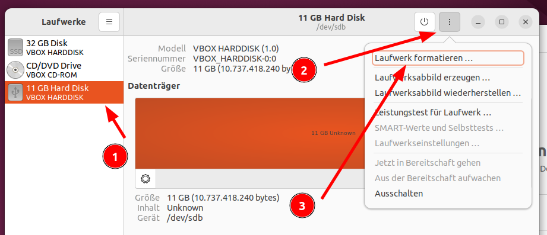
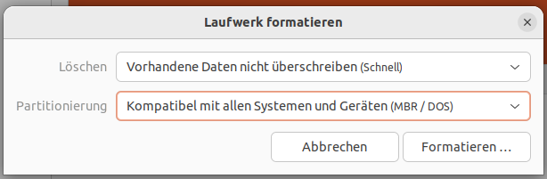
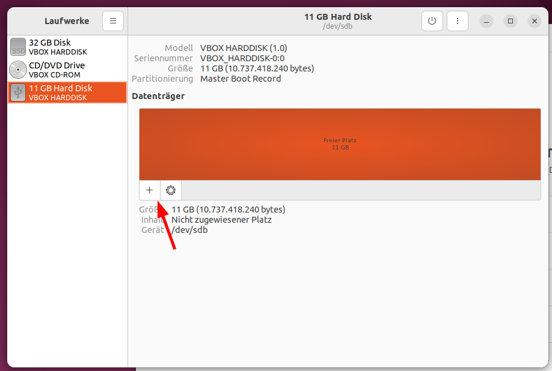
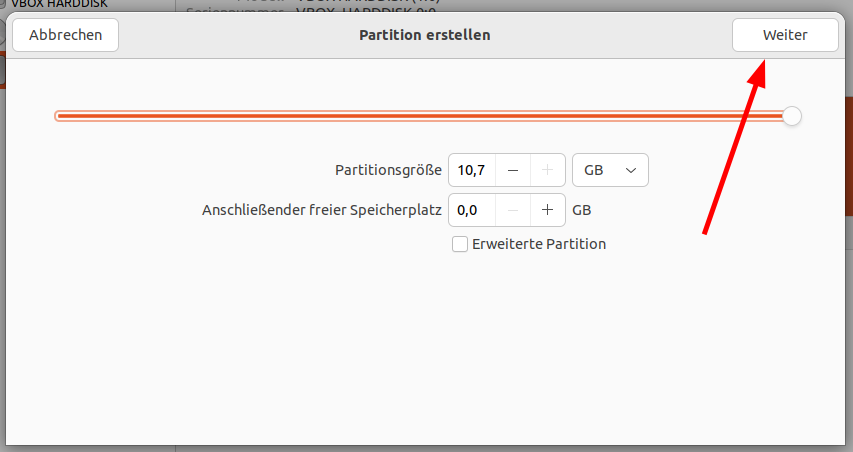
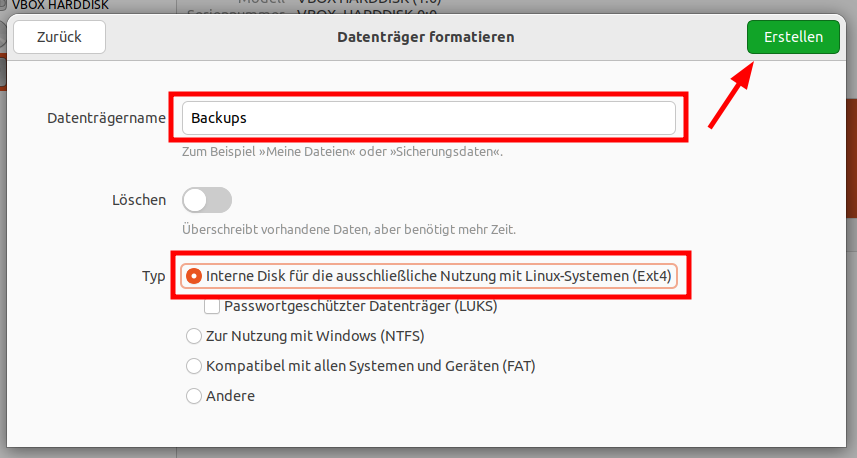

Backups
=======
Backups sind essentiell. Sollten Sie mal einen Fehler machen oder Ihr Rechner/System kaputt gehen, sind Ihre Daten nicht verloren.
Dafür empfehlen wir dringend eine große externe Festplatte, die idealerweise in einem anderen Gebäude oder Zimmer gelagert wird.

Wir setzen auf das in Ubuntu enthaltene Programm ``DejaDup (= Datensicherungen)``.
Es komprimiert Backups, kann diese verschlüsseln und speichert in mehreren Iterationen nur veränderte Daten.
Es nutzt als darunterliegende Technologie ``Duplicity``, welche effizient auf ``rsync`` aufbaut.

.. note:: 
    Jedes BackUp ist auch bei unveränderten Dateien gleich groß, es findet also keine Deduplizierung der Versionen statt.
    Setzen Sie auf Deduplizierung, empfehlen wir das Programm ``Pika Datensicherung`` welches auf ``borg`` aufbaut.

Entweder können die BackUps von DejaDup auf eine Cloud (bspw. Google Drive) oder auf eine externe Festplatte gesichert werden.
Wir empfehlen die externe Festplatte.

Einrichtung
-----------
- Stecken Sie Ihre externe Fesplatte an und formatieren Sie diese gegebenenfalls.

Externe Festplatte formatieren
^^^^^^^^^^^^^^^^^^^^^^^^^^^^^^
Formatieren Sie die externe Festplatte mit dem Programm ``Laufwerke``. 
Die nachfolgenden Bilder beschreiben die einzelnen Schritte.

Einrichtung von Datensicherungen (DejaDup)
^^^^^^^^^^^^^^^^^^^^^^^^^^^^^^^^^^^^^^^^^^
- Starten Sie das Programm ``Datensicherungen``
- Wählen Sie ``Meine erste Sicherung anlegen``.
- Nun können Sie bei ``Zu sichernde Ordner`` weitere Ordner hinzufügen. Standardmäßig wird der Persönliche Ordner gesichert. Dies reicht in der Regel vollkommen aus. Sollten Sie weitere Partitionen wie beispielsweise ``/data`` nutzen, fügen Sie hier die entsprechenden Ordner hinzu.

.. warning:: 
    Sollten Sie Verknüpfungen in Ihrem persönlichen Ordner haben, werden diese vom BackUp-Programm nicht verfolgt.
    Denken Sie dann daran, eventuell eine andere Partition zusätzlich zum BackUp hinzuzufügen.

- Bei ``Zu ignorierende Ordner`` empfehlen wir zusätzlich, folgende Ordner auszuschließen (falls vorhanden):
    - ``Warpinator``
    - ``Tmp``
    - ``VirutalBox VMs``
    - ``.steam``
- Wählen Sie als Sicherungsort Ihre externe Fesplatte. 
- Sollten Sie sensible Daten haben, wählen Sie verschlüsseln Sie Ihre Backups mit einem Passwort, andernfalls erlauben Sie die Wiederherstellung ohne Passwort.

.. warning:: 
    Sollten Sie bei einem verschlüsselten Backup Ihr Passwort vergessen/verlieren, gibt es keine Möglichkeit, das Backup wiederherzustellen.

- Anschließend wird die erste Datensicherung angelegt. Dieser Prozess kann länger dauern.  
- 
.. note:: 
    Sollte die Datensicherung beim Ersten Mal fehlschlagen, stellen Sie sicher, dass Sie Schreibrechte im ausgewählten Sicherungsort haben.
    Sollte dies nicht der Fall gewesen sein, müssen Sie unter Umständen die Einrichtung wiederholen.

Durchführung
------------
Wir empfehlen, Backups beispielsweise jede Woche oder jeden Monat auszuführen.
Schließen Sie Ihre externe Festplatte an, öffnen Sie ``Datensicherungen`` und klicken Sie auf ``Jetzt sichern``.
Starten Sie am besten BackUps direkt vor dem Feierabend.

Wiederherstellung von Daten
---------------------------
.. tip:: 
    Es ist sehr wichtig, dass Sie diesen Schritt einmal ausprobieren.
    Somit sind Sie auf einen Ernstfall vorbereitet und wissen, dass Ihr Backup funktioniert.

- Öffnen Sie ``Datensicherungen`` und klicken Sie oben auf ``Wiederherstellen``.
- Wählen Sie unten rechts Ihren gewünschten Zeitpunkt aus.
- Nun können Sie Ordner und/oder Dateien auswählen und unten links auf ``Wiederherstellen`` klicken.   
