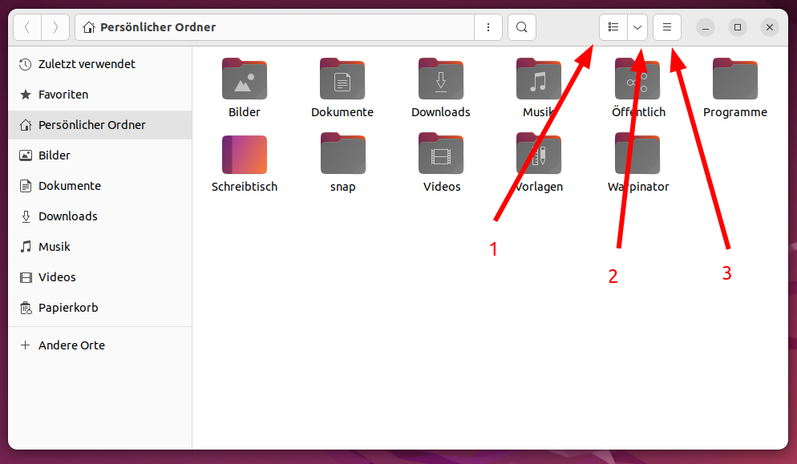
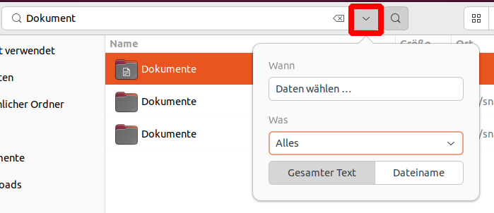

Dateien
================

Ansichtseinstellungen
---------------------

- (1) Hier kann man zwischen der Symbolansicht und der Listenansicht umschalten. Letztere zeigt mehrere Informationen über die Dateien wie bspw. das letzte Änderungsdatum.
- (2) Hier kann man die Symbolgröße der Ordner und die Sortierung einstellen. 
- (3) Hier können neue Fenster, Tabs und neue Ordner erstellt werden. Außerdem können hier verborgene Dateien angezeigt und die linke Seitenleiste verborgen werden.

.. tip:: 
    Mit der Tastenkombination ``Strg`` + ``H`` kann man versteckte Dateien ein- und ausblenden.

.. tip::
    Mit der Taste ``F5`` kann der Ordner aktualisiert werden.

.. tip::
    Weitere Tabs kann man mit ``Strg`` + ``T`` erstellen, Neue Fenster mit ``Strg`` + ``N``.

Suche
-----

Tippen Sie einen normalen Buchstaben im Dateimanager, wird automatisch der Such-Modus gestartet. 
Unter dem im Bild Markierten Knopf können Sie ganz konkrete Such-Kriterien bezüglich letztem Änderungsdatum und dem Datei-Typ machen.
Außerdem haben Sie darunter die Option, entweder auch Datei-Inhalte (= Gesamter Text) oder nur die Dateinamen zu durchsuchen.

Mit der ``Esc`` Taste brechen Sie die Suche wieder ab.

Lesezeichen
-----------
Sie können für häufig genutzte Ordner Lesezeichen anlegen. 
Ziehen Sie dafür einfach den gewünschten Ordner an die Seitenleiste unter 'Lesezeichen'.
Das Lesezeichen ist somit unter allen Auswahldialogen und im Dateimanager schnell aufzurufen.

Es empfiehlt sich sehr, die Lesezeichenliste nach Alphabet zu sortieren. Dies muss manuell bewerkstelligt werden.

Favoriten
---------
Sie können beliebige Dateien oder Ordner als Favorit markieren (Rechtsklick).
Favoriten erhalten einen eigenen Eintrag im Dateimanager.

Wir empfehlen, häufig verwendete Dateien als Favoriten abzuspeichern. Ordner sollten im Besten Fall nur als Lesezeichen abgespeichert werden.

Verknüpfungen
-------------
Um Verknüpfungen zu erstellen, halten Sie ``Strg`` + ``Shift`` gedrückt und ziehen Sie mit der Maus einen Ordner oder eine Datei an die Stelle,
an der Sie die Verknüpfung haben wollen. 

Andernfalls können Sie eine Verknüpfung mit ``Shift`` + ``Strg`` + ``M`` erstellen.

TODO: FUNKTIONIERT IRGENDWIE NOCH NICHT!!

Archive erstellen und Entpacken
-------------------------------
``.zip``, ``.tar.gz`` oder weitere Archive können Sie im Dateimanager direkt entpacken oder erstellen.
Sie benötigen dazu keine externes Programm.

Archiv erstellen
^^^^^^^^^^^^^^^^
- Klicken Sie mit der rechten Maustaste auf einen Ordner oder eine Datei und wählen Sie ``Komprimieren ...`` aus.
- Nun können Sie den Dateinamen und das Archiv-Format definieren. ``.tar.xz`` Dateien können in der Regel nur Unix-Systeme lesen. Mit ``.zip`` Archiven machen Sie meist nichts falsch.
- Klicken Sie nun auf ``Erstellen``. Je nach Größe des Ordners kann dies einige Minuten dauern.

Archiv entpacken
^^^^^^^^^^^^^^^^
- Klicken Sie mit der rechten Maustaste auf ein Archiv.
- Wählen Sie ``Hier entpacken`` aus.

.. note:: 
    Möchten Sie andere Sachen mit Archiven erledigen, können Sie dies über die ``Archivverwaltung`` machen.

Auf entfernte Server zugreifen
------------------------------
- Wählen Sie in Dateien ``+ Andere Orte`` aus.
- Geben Sie unten bei ``Mit Server verbinden`` eine gültige Adresse ein. Ein Beispiel wäre: ``ftp://www.example.com/ordner/unterordner``

Danach sind die Verbindungen in der Seitenleiste des Dateimanagers unter 'Netzwerk' verfügbar.

Ordner freigeben
----------------
.. note:: 
    Dazu muss das Paket ``Samba`` installiert sein und ggf. die Anwendung ``SAMBA`` in den Firewall-Regeln hinzugefügt sein. 
    Außerdem muss der aktuelle Benutzer in der Gruppe ``sambashare`` sein. (Siehe Kapitel *Benutzer und Berechtigungen*)

Klicken Sie mit der rechten Maustaste auf den gewünschten Ordner und wählen Sie ``Freigabeoptionen``. 
Der Konfigurationsdialog sollte selbstverständlich sein.
Wählen Sie ``Gastzugriff`` nicht aus, 
muss sich der Benutzer mit einem auf dem Rechner definierten Benutzerkonto anmelden, um auf den Ordner zuzugreifen können.

.. note::
    Wir nutzen im Alltag die Ordner-Freigabe nicht. Stattdessen setzen wir hier auf Nextcloud.

Dateimanagment
--------------
Hier ein paar Tipps, die langfristig die Produktivität steigern können. Außerdem dankt dies Ihre Backup-Platte und Ihr zukünftiges Ich.

- Versuchen Sie, die vorgegebene Struktur einzuhalten und pro Projekt/Arbeitsauftrag einen eigenen Ordner anzulegen. Es lohnt sich auch, die einzelnen Projekte in Jahre und/oder Monate einzuordnen.
- Nutzen Sie die Nextcloud, können Sie bspw den Dokumenten Ordner über eine Verknüpfung in den Nextcloud-Synchronisations-Ordner zeigen lassen.
- Haben Sie auch manchmal das Problem, dass Sie nicht wissen, wo man schnell mal kurz nur diese Datei abspeichen soll? Wir empfehlen das Anlegen eines zusätzlichen ``Tmp`` (Temporären) Ordners. In Ihm können Dateien gespeichert werden, die man nach Ende der Woche sicher nicht mehr braucht. Am Ende der Woche löscht man dann ganz einfach den Inhalt.
- Arbeiten Sie nicht im Downloads-Ordner. Wenn Sie dies einhalten, können Sie Ihren Downloads-Ordner wöchtenlich komplett leeren.
- Versuchen Sie, nichts auf der Arbeitsfläche selber zu speichern. Dies ist für die Ordner-Struktur sehr hilfreich.
- Im Persönlichen Ordner selber sollten nur wichtige Ordner sein. Dokumente oder Bilder haben hier nichts verloren.