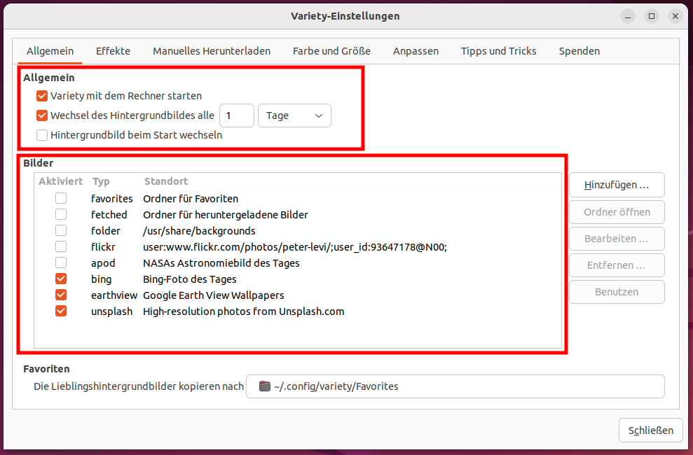
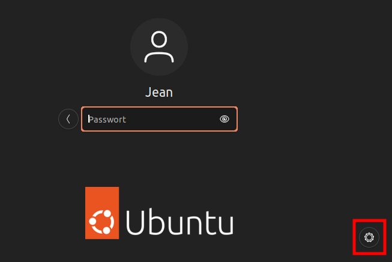

Die Oberfläche (Gnome)
======================

Ubuntu setzt seit einigen Jahren auf den Desktop Gnome, welcher einer der modernsten und weit verbreitesten Desktops ist.

.. note::
    In den folgenden Zeilen wird häufig die ``Super``-Taste referenziert. Diese wird auch im normalen Sprachgebrauch als "Windows"-Taste benannt.

Das Menü
--------

In der unten Linken Ecke kann man das Gnome-Menü öffnen.
Durch das Ziehen der einzelnen Applikationen können diese in eine andere Anordnung gebracht werden oder Ordner im Menü erstellt werden.
Mit ``Super`` + ``A`` kann man ebenfalls das Menü aufrufen.

.. tip::
    **Eine Anwendung in kürzester Zeit öffnen:**
    - ``Super``-Taste drücken
    - Den Namen der Applikation eingeben (Es reicht auch nur der Anfang des Namens)
    - Mit den Pfeiltasten den Selektor auf die gewünschte Anwendung navigieren
    - Die Eingabe-Taste (Enter) drücken. (Wenn Sie eine weitere Instanz dieser Anwendung starten wollen, drücken Sie anstattdessen ``Strg`` + ``Enter``)

    Dies ist mit ein wenig Übung viel schneller als das Starten von Apps mit der Maus. Versprochen!

Suche
^^^^^
Eine der größten Stärken der Oberfläche ist die Suche, welche direkt im Menü oder der Aktivitäten-Übersicht verfügbar und aktiv ist.
Mit Ihr können unter anderem Apps, Einstellungen, Dateien oder Apps aus der Software-Verwaltung sehr einfach gesucht und geöffnet werden.
In der Regel können Sie direkt einfach lostippen, ohne das Suchfeld zuvor mit der Maus zu anzuwählen.

Diese kann man in den Einstellungen unter ``Suchen`` konfigurieren, und einzelne Kriterien ausschalten oder die Reihenfolge verändern.

Multitasking
------------

Wie von anderen System gewohnt kann man zwischen allen offenen Fenstern mit der Tastenkombination ``Alt`` + ``Tab`` hin und herwechseln.
Zwischen den Anwendungen kann mit mit ``Super`` + ``Tab`` hin und her navigieren.

Zusätzlich gibt es in Gnome die Arbeitsflächen-Verwaltung. Alle aktiven Arbeitsflächen sieht man im Menü. 
Durch einfaches Ziehen der Fenster kann man diese bspw. auf eine neue Arbeitsfläche ziehen. 
Durch das Ziehen eines Fensters in eine leere Arbeitsfläche erstellt sich daneben eine neue leere Arbeitsfläche.
So kann man beliebig viele Arbeitsflächen erstellen.
Möchte man anstattdessen eine statische Anzahl an Arbeitsflächen definieren, kann man dies in den Einstellungen unter ``Multitasking`` erledigen.

.. tip::
    Zwischen den Arbeitsflächen kann man mit der Tastenkombination ``Strg`` + ``Alt`` + ``->`` oder ``<-`` hin und her wechseln.

Darstellung
-----------

Einstellungen bezüglich eines hellen und dunklen Designs, Farben, Schreibtischleiste, und der linken Leiste können in ``Darstellung`` gefunden werden.

Optimierungen (Gnome Optimierung)
^^^^^^^^^^^^^^^^^^^^^^^^^^^^^^^^^
Mit dieser Anwendung können Sie verschiedene weitere Einstellungen für ihre Oberfläche tätigen.

Empfohlen ist beispielsweise unter ``Obere Leiste`` das Aktivieren des Wochentags und der Kalenderwochen im Kalender.

Weitere mögliche Einstellungen wären unter anderem die Schriftart, andere Icons oder das Verhalten und Aussehen von Fenstern.
Diese Anwendung muss nachinstalliert werden.

Nachtmodus
^^^^^^^^^^
Um die Augen besonders Abends zu schonen, ist ein Blau-Licht-Filter empfehlenswert.
Die Oberfläche Gnome bringt direkt einen mit: In den Einstellungen im Abschnitt ``Anzeigegeräte`` unter ``Nachmodus`` kann man diesen bequem konfigurieren.

Erweiterungen
-------------
Es gibt zahlreiche Erweiterungen, die die Oberfläche funktionaler oder schöner machen.
Alle Erweiterungen kann man auf `https://extensions.gnome.org/ <https://extensions.gnome.org/>`_ ansehen.

.. note::
    Aufgrund der Snap-Implementierung von Firefox funktioniert in der neusten Version die Gnome-Extension Integration nicht mehr.

Manche Erweiterungen kann man auch über den Software-Center installieren. Ein Beispiel wäre ``GSConnect``. 
Damit können sich Smartphones mit der App ``KDE-Connect`` (erhältlich im Google Play-Store oder F-Droid) mit dem Computer verbinden und bspw. die Medienwiedergabe steuern,
oder SMS vom Computer aus geschrieben werden.

Hintergrundbild
---------------
Um das Hintergrundbild zu ändern können Sie dies in den Einstellungen unter ``Hintergrund`` tun.
In der Fensterleiste oben befindet sich auch ein Knopf, um ein eigenes Hintergrundbild einzustellen.

Variety
^^^^^^^
Das nachinstallierbare Programm lädt automatisch Hintergrundbilder herunter und zeigt beispielsweise das Hintergrundbild des Tages von Bing.
Die Einstellungen sind vielfältig aber selbstverständlich. Die empfohlenen Einstellungen sind der Abbildung zu entnehmen.

13 Magische Tastenkombinationen
-------------------------------

- ``Super`` + ``A``: Menü anzeigen
- ``Super`` + ``L``: Bildschirm sperren
- ``Super`` + ``D``: Desktop anzeigen
- ``Super`` + ``V``: Benachrichtigungen und Kalender anzeigen
- ``Shift`` + ``Super`` + ``Pfeiltaste nach links``: Fenster auf die linke Seite "bringen"
- ``Shift`` + ``Super`` + ``Pfeiltaste nach rechts``: Fenster auf die rechte Seite "bringen"
- ``Shift`` + ``Super`` + ``Pfeiltaste nach oben``: Fenster maximieren
- ``Super`` + ``H``: Fenster minimieren
- ``Alt`` + ``F4``
- ``Druck``: Bildschirmfoto machen
- ``Strg`` + ``Alt`` + ``Pfeiltaste nach rechts`` : Zur rechten Arbeitsfläche wechseln
- ``Strg`` + ``Alt`` + ``Pfeiltaste nach links`` : Zur rechten Arbeitsfläche wechseln
- ``Strg`` + ``Àlt`` + ``Entf``: Ausschalten-Dialog anzeigen

Probleme mit der Oberfläche?
----------------------------
Funktioniert eine gewisse Anwendung nicht oder hat Probleme in der Darstellung?
Probieren Sie bei der Anmeldung, ``Ubuntu auf Xorg`` unter dem Zahnrad auszuwählen.
Dies ist das alte Protokoll für das Display.

