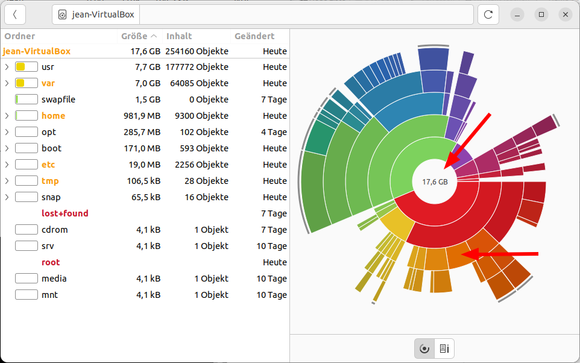

Nützliche Programme
===================

In diesem Kapitel sollen weitere Anwendungen auf Ubuntu vorgestellt werden,
die die Produktivität steigern.

Firefox
-------
Firefox ist einer der besten und sichersten Webbrowser.
Anstattdessen können Sie auch Brave, Google Chrome, Opera oder Microsoft Edge installieren.
Doch geben Sie Firefox eine Chance: 
Mit ein paar Einstellungen vereint er Privatspähre, Freiheit und Benutzerfreundlichkeit.

Privatsphäre schützen
^^^^^^^^^^^^^^^^^^^^^
Viele möchten sicher einfach nur ungestört surfen.
Firefox ist einer der wenigen Browser, die von Haus aus viele Privatsphäre-Einstellungen mitbringen.

In den Einstellungen können Sie unter ``Datenschutz & Sicherheit`` den verbesserten Schutz vor Aktivitätenverfolgung auf ``Streng`` stellen.
Zusätzlich empfehlen wir das Addon `uBlock Origin <https://ublockorigin.com/>`_, welches Werbung blockiert.

.. tip::
    Sollte eine Webseite mal nicht so funktionieren,
    wie Sie sich das wünschen können Sie Rechts oben im roten Schild uBlock Origin für diese Webseite ausschalten.
    Den eingebauten Firefox-Schutz können Sie am linken Ende der Adresszeile im Schild für diese Webseite ausstellen.

In den Einstellungen unter ``Suche`` können Sie auch die Standard-Suchmaschine umstellen.
Wir empfehlen ``DuckDuckGo`` oder ``Ecosia``. Dadurch bleiben Ihre Suchanfragen weitestgehend anonym.

.. tip:: 
    Sollten Sie die Lesezeichen-Liste nutzen, empfehlen wir
    unter ``Weitere Werkzeuge -> Symbolleiste anpassen`` unten links
    ``Symbolleisten -> Lesezeichen Symbolleiste`` auf ``Nur bei neuem Tab anzeigen`` einzustellen.

.. note::
    Es besteht die Möglichkeit, sich ein Firefox-Konto zu erstellen und Lesezeichen oder Passwörter mit anderen Geräten zu synchronisieren.

Bitwarden
---------
Bitwarden verwaltet sicher Ihre Passwörter. Bitwarden ist Open Source und vertrauenswürdig.
Sollten Sie Bitwarden selber doch nicht vertrauen, besteht sogar die Möglichkeit seinen eigenen Bitwarden-Server aufzusetzen.

Bitwarden können sie einfach aus Ubuntu-Software installieren.
Ein Brwoser-Addon gibt es auch dazu, was sehr zu empfehlen ist.

.. warning::
    - Verwenden Sie Passwörter niemals doppelt!
    - Wenn möglich, empfehlen wir die Aktivierung der Zwei Faktor Authentifizierung
    - Verwenden Sie für Bitwarden ein sicheres Passwort mit Sonderzeichen, welches keine auf Sie rückschließende Komponenten beinhaltet.

Warpinator
----------
Mit diesem Programm können Sie sehr einfach Dateien im lokalen Netzwerk verschicken.>
Es ist lediglich nur unter dem Flathub verfügbar (siehe Kapitel Programme installieren)
Das Programm gibt es für Linux, Windows, Android und in Zukunft auch für iOS.

.. note:: 
    Hat man die Firewall aktiv, muss man in den Firewall-Einstellungen die Ports ``42000 (TCP, UDP)`` und ``42001 (TCP)`` freischalten.

    .. image:: images/warpinator_firewall.png
    

Startmedienersteller
----------------------
Auf Linux Mint sind die Programme ``USB-Stick-Formatierer`` und ``USB-Abbilderstellung`` bereits vorinstalliert.

Mit der USB-Abbilderstellung können Sie beispieslweise ``.iso`` Dateien auf einen USB-Stick schreiben.
Damit können Sie dann auf anderen Rechnern bspw. Linux installieren.

Laufwerke
---------
Mit diesem Programm können Sie Partitionen auf Ihrer Fesplatte bearbeiten und bspw. verschiedene Einhängeoptionen vornehmen.

Alternativ können Sie auch USB-Sticks formatieren und iso-Abbilder schreiben.

Shotwell
--------
Mit Shotwell lassen sich Fotos aus dem Handy oder der SD-Karte importieren und einfache Bearbeitungen vornehmen.
Wollen Sie Fotos genauer bearbeiten gibt es dafür die Programme ``Darktable`` oder ``GIMP``.

Systemüberwachung
-----------------
Das Pendant dazu auf Windows ist der Taskmanager.
Über die Systemüberwachung können Sie Prozesse beenden, sollte einer sich aufhängen.
Im Reiter ``Ressourcen`` finden Sie verschiedene Diagramme, die den aktuellen Verbrauch
von Arbeitsspeicher, der Internetverbindung und die Auslastung der Prozessor-Kerne zeigen.

Festplattenbelegungsanalyse
---------------------------

Mit dem Programm kann man sehr einfach seine Festplattenbelegung sehen.
Klickt man auf einen Ringabschnitt, navigiert man in den Ordner.
Möchte man wieder den übergeordneten Ordner ansehen, kann man in die Mitte des Diagramms klicken.

Ihre Wissensdatenbank
---------------------
Egal, was Sie an Ihrem Computer oder auf Ihrer Arbeit erledigen.
Das Schreiben eigener Anleitungen ist langfristig für die Produktivität essentiell.

Sie können dies entweder über die ``Notizen`` App machen, oder über Nextcloud Notes.

.. tip:: Wir empfehlen Nextcloud Notes. Diese App gibt's auch für Android.

Bildschirmfoto
--------------
Mit diesem Programm können Sie einfach Screenshots erstellen.

1. Mit ``Druck`` können Sie einen Screenshot von der gesamten Bildschirmfläche erstellen.
2. Mit ``Alt`` + ``Druck`` können Sie einen Screenshot vom aktuellen Fenster erstellen.
3. Mit ``Shift`` + ``Druck`` können Sie eigenen Bildschirmbereich festelegen, der abfotografiert werden soll.

Möchten Sie erweitere Screenshots erstellen, empfehlen wir das Programm ``Flameshot`` aus Ubuntu-Software.
