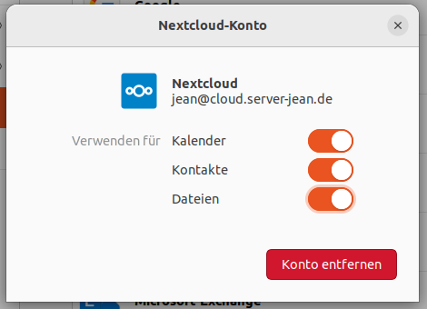

Onlinekonten
============

Onlinekonten erlauben es, den Kalender, Dateien, Kontakte und mehr mit einer Cloud zu synchronisieren.
Beim ersten Start von Ubuntu besteht bereits die Möglichkeit, ein Onlinekonto einzurichten. 
Nachholen kann man dies in den Einstellugen under ``Online-Konten``.

Mögliche Kandidaten wären:

- Nextcloud (empfohlen)
- Google
- (Microsoft)

Daraufhin wird je nach dem gefragt, was hinzugefügt werden soll. In der Regel sind dies bei Nextcloud der Kalender, Kontate und Dateien.

.. tip:: 
    Möchte man auf das Adressbuch zugreifen, muss man dafür die Anwendung ``gnome-contacts`` aus der Anwendungsverwaltung installieren.

.. tip:: 
    Damit auch automatisch auf Mails zugegriffen werden kann, wird das E-Mail Programm Evolution benötigt. 
    Andernfalls kann man auch ohne großen Aufwand das Mail-Konto in Thunderbird hinzufügen.

Nextcloud
---------

Nextcloud ist eine freie kollaborative Cloud, die man in Eigenregie hosten kann, oder bei einigen Anbietern mieten kann.

Wichtig ist im "Hinzufügen"-Dialog die Serveradresse beispielsweise so einzutragen: ``https://cloud.example.com/``.
Danach werden automatisch alle Kalender, Adressbücher und Dateien unter Ubuntu verfügbar gemacht.

Nextcloud-Client
^^^^^^^^^^^^^^^^

Standardmäßig sind die Dateien (unter dem WebDAV-Protokoll) im Dateimanager links in der Leiste oder unter "Netzwerke" zu sehen.
Allerdings sind die Dateien so nicht direkt heruntergeladen sondern nur direkt aus der Cloud.

Arbeitet man viel mit den Dateien in der Nectcloud ist dringend empfohlen, sich den Nextcloud Desktop Synchisations-Client einzurichten.
Das Programm kann man entweder unter ``Nextcloud Desktop Client`` oder unter ``Nextcloud Client`` finden (inoffiziell).
Offiziell kann man den Nextcloud-Desktop Client hier herunterladen: `nextcloud.com <https://nextcloud.com/install/#install-clients>`_ 
Die Anmeldung und Einrichtung sollte selbsterklärend sein. Empfohlen wird die inoffizielle Variante, da sich diese technisch nicht vom original unterscheiden und einfacher handzuhaben sind.

.. tip:: 
    Nach der Einrichtung ist es empfohlen, unter ``Startprogramme`` den Nextcloud Client hinzuzufügen. Damit wird beim Anmelden der Synchisations-Client direkt gestartet.

Google
------

Das Hinzufügen sollte unter ``Online-Konten`` selbstverständlich sein.

Daraufhin können Kalender, Kontakte, Fotos, Dateien, Emails und Drucker von Ubuntu aus zugegriffen werden.

.. tip:: text

Microsoft
---------

Unter Microsoft können lediglich E-Mails automatisch hinzugefügt werden. Dafür wird bspw. das Programm Evolution benötigt.
Empfohlen wird daher diese Integration nicht.

Thunderbird
-----------

Thunderbird ist eines der besten Mail-Programme unter Linux. Wenn Sie es bis jetzt nicht kennen, geben Sie Thunderbird eine Chance!

.. note:: 
    Um Ihre Mail-Adresse hinzuzufügen, müssen Sie sicherstellen, dass bei Ihrem Mail-Account die IMAP und SMTP Option aktiviert sind.
    Das können Sie in der Regel bei Ihrem Mail-Anbieter unter 'Sicherheit' oder 'Drittanbieter Apps' einstellen.

Das Hinzufügen eines neuen Mail-Kontos zu Thunderbird ist selbsterklärend

Adressbuch der Nextcloud nutzen
^^^^^^^^^^^^^^^^^^^^^^^^^^^^^^^

.. image:: images/thunderbird-carddav

- Öffnen Sie wie im Bild gezeigt den "Hinzufügen"-Diagog.
- Tragen Sie Ihren Nextcloud-Benutzernamen und die Adresse Ihrer Nextcloud ein. Beispiel: ``https://cloud.example.com/``
- Geben Sie das Passwort Ihres Nextcloud-Kontos im nächsten Dialog ein.
- Im letzten Dialog können Sie die Adressbücher auswählen. Es wird empfohlen, ``Zuletzt kontaktiert`` abzuwählen. Klicken Sie daraufhin auf ``Weiter``. 
- Ihr Adressbuch wurde nun hinzugefügt.

