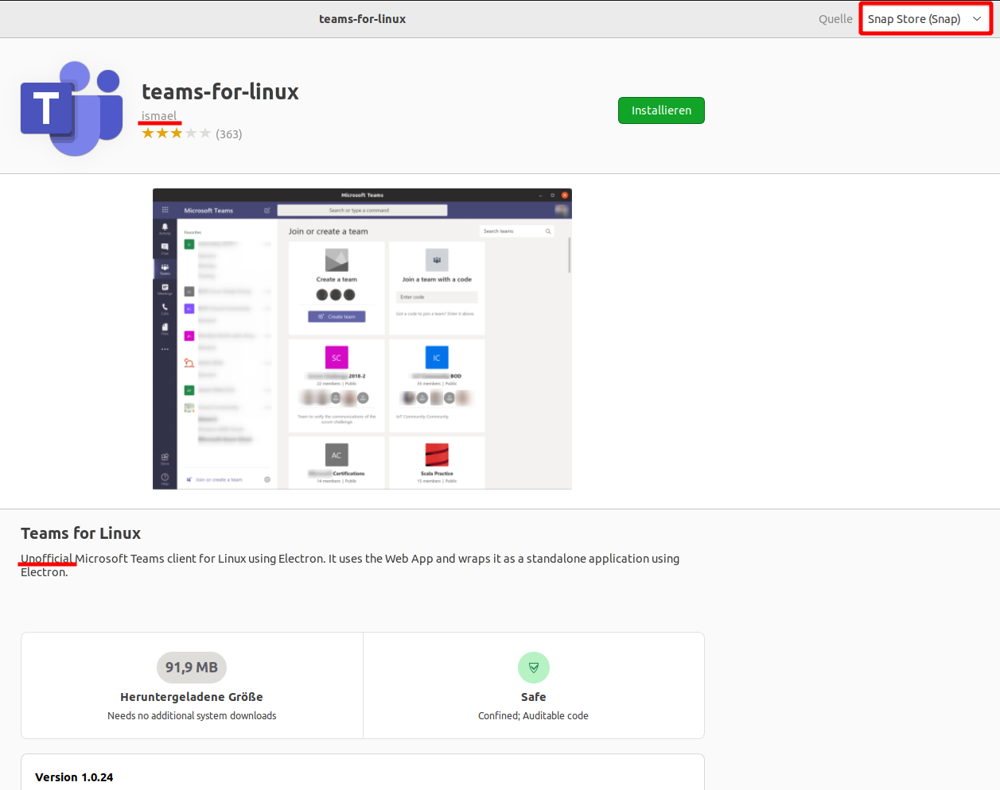
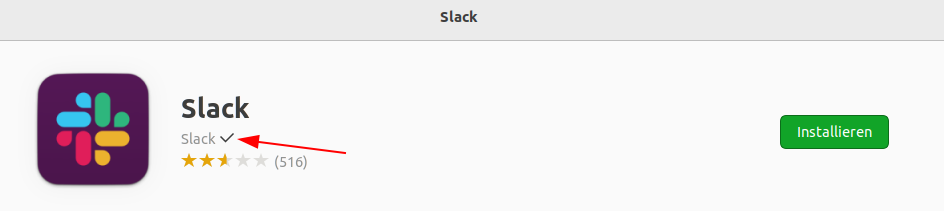
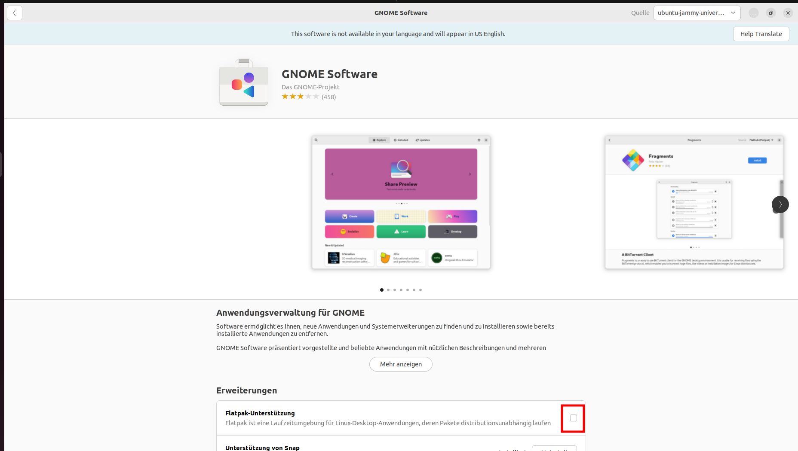

Programme installieren
======================

Ubuntu-Software
---------------
Diese sollte die erste Anlaufstelle sein, wenn man Anwendungen installieren möchte. 
Die Beschreibung ist meist aufschlussreich und empfehlenswert.

Beispiel Microsoft Teams:
^^^^^^^^^^^^^^^^^^^^^^^^^

Wenn man sich den Beschreibungstext durchliest, erfahren wir, 
dass diese Ausführung nicht offiziell von Micorosoft unterstützt wird.
Das heißt, Dritte stellen das Programm zur Verfügung. 
Dies erkennt man auch, dass als Veröffentlicher ``ismael`` angegeben wird.
Sollten also während der Benutzung Fehler auftreten, 
könnte das auf diesen Sachverhalt zurückzuführen sein.

Generell spricht nichts gegen die Verwendung von solchen Ausführungen,
man sollte es aber im Hinterkopf behalten, dass das eine inoffizielle Ausführung ist.
Häufig bemerkt man allerdings als Endnutzer keinen Unterschied.

Möchte man hingegen die offizielle Version installieren,
werden Details dazu im nächsten Abschnitt ``.deb Dateien aus dem Internet`` beschrieben.

Offizielle Anwendungen
^^^^^^^^^^^^^^^^^^^^^^
Manche Anwendungen sind offiziell von den Entwicklern für Ubuntu-Software herausgegeben.
Dies kann man an dem Haken neben dem Veröffentlicher erkennen.

Quelle
^^^^^^
Aus dem ersten Screenshot (mit Teams) kann man oben rechts neben den Fensterknöpfen die Quelle einsehen.
Verschiedene Quellen werden im nächsten Abschnitt besprochen.

Berechtigungen
^^^^^^^^^^^^^^
Ist ein Programm installiert, können bei bspw sog. Snap-Anwendungen direkt Berechtigungen eingestellt werden.
Dieser Knopf erscheint direkt neben dem Löschen-Knopf.

Dort kann wie bspw. in Android eingestellt werden, was die jeweilige Anwendung darf.
Sollte sich beispielsweise eine solche Anwendung komisch verhalten, wenn eine Datei geöffnet werden soll,
dann sollte man in den Berechtigungen dieser Anwendung überprüfen, ob diese auch auch den Datei-Zugriff erlauben.
Man kann die Berechtigungen zusätzlich in ``Einstellungen`` unter Programme einstellen.

Quellen in Ubuntu
-----------------
Zwei Quellen sind standardmäßig in Ubuntu aktiviert:

- ``Snap-Store`` 
- ``Ubuntu (deb)``

Snap
^^^^
Snap ist die neue Technologie von Ubuntu, auf Linux Programme zu installieren und auszuführen.
Alle verfügbaren Anwendungen kann man auch auf `Snapcraft.io <https://snapcraft.io>`_ durchstöbern, dem sog. ``Snap-Store``.

Snaps haben den Vorteil, dass sie auf jedem Linux unabhängig von der Version laufen sollen und in der Regel top aktuelle Versionen eines Programms bieten.
Dazu laufen sie in ihrem eigenen kleinen "Linux", auch Sandkasten genannt.
Allerdings können so bei manchen Snaps Kompatibilitäts-Probleme im Zusammenspiel vorallem mit anderen Programmen auftreten,
da diese nicht in die kleinen "Sandkästen" herein oder aus ihren eigenen heraus kommen.

Dies bringt eine neue Sicherheitsschicht mit sich: Durch diese kann man kontrollieren, 
was ein Snap-Programm auf dem System machen darf.

.. warning:: 
    Auch wenn Snap-Anwendungen eine neue Sicherheitsschicht haben, kann diese durch bösartige Anwendungen umgangen werden.
    Hat es eine Anwendung also abgesehen, aus dieser Schicht auszubrechen, kann sie dies bis zu einem gewissen Grad auch tun.

Ubuntu (deb)
^^^^^^^^^^^^
Dies ist die "alte" Paketverwaltung von Ubuntu, welche seit über 20 Jahren genutzt wird.
Über diese werden Anwendungen im .deb-Format zur Verfügung gestellt.

Allerdings aufgrund von Versions-Bindungen verschiedener Bibliotheken wird es besonders bei älteren Ubuntu-Versionen schwer,
die aktuellste Version von einem Programm zum Laufen zu bringen. 
Unter anderem deswegen wird nun immer weiter die Snap-Variante in den Vordergrund gerückt.

Über diese Quelle lassen sich viele traditionelle Linux-Anwendungen installieren, welche aber etwas älter sein könnten.

Flatpak
^^^^^^^
Dies ist das "freiere" Pendant zu Ubuntus Snap Universum, auf das der Rest der Linux-Welt setzt.
Es hat ungefähr die gleichen Funktionen wie Snap und funktioniert ähnlich.
Das "Zuhause" von Flatpak ist das `Flathub <https://www.flathub.org>`_, wo sich so ziemlich alle restlichen Anwendungen in der Linux-Welt finden lassen.
Es ist standardmäßig nicht auf Ubuntu installiert

Dennoch sind keine Flatpak-Anwendungen direkt über Snap installierbar.

In diesem Kurs werden vereinzelt Anwendungen vorgestellt, welche sich in Ubuntu ausschließlich über Flatpak installieren lassen.

.. note:: 
    **Was ist besser? Flatpak oder Snap?** Dies muss jeder für sich entscheiden. 
    Klar ist, dass sich hier die Linux-Welt spaltet. 
    Außerhalb von Ubuntu benutzen fast alle Linux-Distributionen standardmäßig Flatpak.
    Das liegt daran, dass Flatpak und das zugehörige Flathub von unabhängigen Personen entwickelt und gepflegt wird.
    Außerdem besteht die Möglichkeit sein eigenes kleines Flathub aufzubauen, was auch manche Distributionen wie Fedora machen.
    Doch im Gegenzug werden die meisten großen proprietären Anwendungen nur im Snap-Store offiziell angeboten, 
    da sich die Firma hinter Ubuntu sehr darum gekümmert hat und die großen Software-Hersteller dabei unterstützt hat.

| **Flatpak auf Ubuntu einrichten:**
| - In Ubuntu-Software nach ``gnome-software`` suchen und dies ggf. nachinstallieren. 
| - Unter ``Erweiterungen`` im gnome-software Eintrag die Flatpak Unterstützung installieren (siehe Abbildung) 
| - Installieren Sie folgende Datei: `https://flathub.org/repo/flathub.flatpakrepo <https://flathub.org/repo/flathub.flatpakrepo>`_ (öffnen mit ``Anwendungsinstallation``) 
| - Den Rechner neustarten. 
| Danach kann man in der Anwendung ``Software`` (nicht Ubuntu-Software!!) Flatpak-Pakete installieren. 

.deb Dateien aus dem Internet
-----------------------------

Manchmal kann es sinnvoll sein, auf die Programme aus der Anwendungsverwaltung zu verzichten und 
die offizielle Version eines Programms zu installieren.

.. warning:: 
    Man sollte unbedingt auf die Quelle der .deb Datei achten. 
    Bitte nur ausschließlich .deb Dateien von offiziellen Herstellerseiten installieren.
    Eine .deb Datei kann ALLES mit dem System machen:
    Das Zerstören des kompletten Systems, Wiederherstellungspunkten und aller persönlicher Dateien kann man extrem schnell erreichen.

**Sollte die .deb Version der Herstellerseite keine nennenswerten Vorteile bringen,
wird dringendst von der Installation abgeraten, da das Sicherheitsrisiko für das System extrem hoch sein kann.**

Für manche Anwendungen ist aber eine .deb Version unumgänglich, wenn man die Anwendungen nutzen möchte:
Beispielsweise wäre das:

- Softmaker Office
- weitere Anwendungen, die man nicht in Ubuntu-Software oder Software finden kann.

Um eine .deb Datei zu installieren, reicht es, diese herunterzuladen.
Danach sollte man diese mit ``Software-Installation`` starten.
Letztendlich kann man wie gewohnt auf ``Installieren`` drücken.

AppImages
---------

AppImages sind ganz spezielle Dateien: Sie enthalten alles, was eine Anwendung zum Laufen braucht.
Eine Installation ist nicht nötig. Es reicht lediglich, diese in einen Ordner (beispielsweise 'Programme') zu verschieben
und diese in den Datei-Eigenschaften unter Zugriffsrechte als ausführbar zu markieren. (Siehe Benutzer und Berechtigungen)
Danach kann man das Programm durch einen Doppelklick auf die AppImage Datei starten.

.. tip:: 
    Man kann in den Menüeinstellungen (``alacarte``, muss nachinstalliert werden) einen neuen Menü-Eintrag für das Programm definieren.
    Dann kann man ein AppImage wie alle übrigen Anwendungen über das Startmenü starten.

.. note:: 
    AppImages werden nicht automatisch aktualisiert. Sicherheitsrelevante Anwendungen nutzen dieses Format aber sowieso nicht.

Fremdquellen (PPAs)
-------------------

Manche Anwendungen findet man nicht in der Anwendungsverwaltung. Anstattdessen "manuell" .deb Dateien zu installieren,
bieten manche Hersteller *Personal Package Archives* (PPAs) an.
Der Vorteil dabei ist, dass Anwendungen daraus auch automatisch Updates erhalten, 
was bei .deb Dateien aus dem Internet normalerweise nicht der Fall ist.

.. note:: 
    Manche .deb Dateien richten automatisch eine Fremdquelle ein und stellen sicher, dass das Programm automatisch Updates erhält.
    Google Chrome macht dies beispielsweise. (Dies muss nicht unbedingt ein PPA sein, wäre aber hier etwas zu weit ausgeholt)

Um ein PPA Ubuntu hinzuzufügen, muss hier ein Terminal-Befehl eingegeben werden. Ein Beispiel wäre:
``sudo add-apt-repository ppa:lutris-team/lutris``

Anschließend kann man die Anwendung aus dem PPA ganz einfach in Ubuntu-Software finden.

.tar.gz oder .zip Dateien
-------------------------

Manchmal bieten Programm-Hersteller nur eine .tar.gz oder .zip Datei an.
Dies geschieht sehr selten und wird einem im regulären Linux-Alltag eigentlich nie begegnen.

Solche Dateien sollte man entpacken. Meist findet man dann dort eine ausführbare Datei (=meist keine Dateiendung oder ``.run``), die man dann starten kann.

.. tip:: 
    Man kann in den Menüeinstellungen einen neuen Menüeintrag für das Programm definieren. (Programm: ``alacarte``)
    Dann kann man dies wie alle anderen Anwendungen über das Startmenü starten.

.. note:: 
    AppImages werden nicht automatisch aktualisiert. Sicherheitsrelevante Anwendungen nutzen dieses Format aber sowieso nicht.

Sollte man keine ausführbare Datei finden und liegt stattdessen eine Datei mit dem Namen
``Makefile`` vor, muss man dieses Programm erst kompilieren. 
Dies wird allerdings im **Linux für Fortgeschrittene** Kurs behandelt.