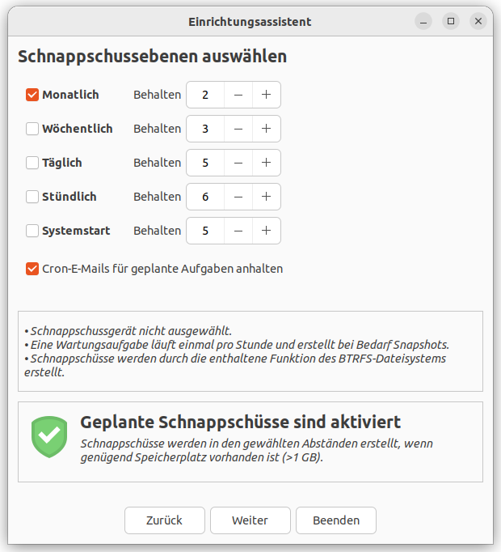
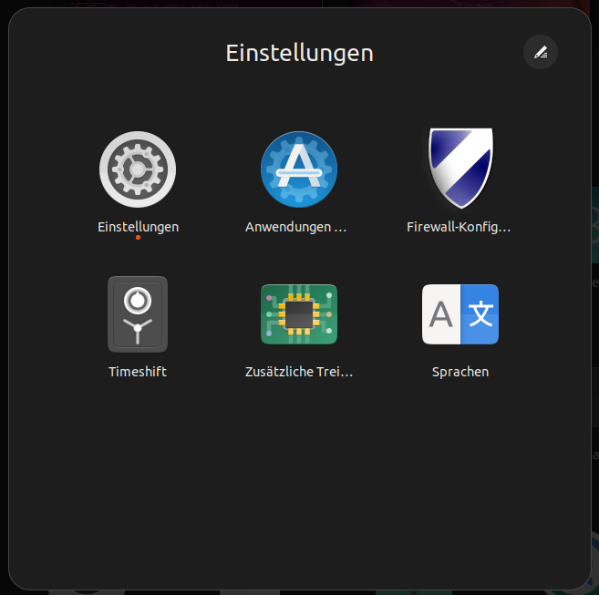

ToDos nach der Installation
===========================

Anzeigegeräte
-------------
In den Einstellungen unter "Anzeigegeräte" können Sie die rictige Auflösung einstellen. 
In den meisten Fällen dürfte dies ``1920x1080`` sein.
Wählen Sie hier die richtige Auflösung aus und klicken Sie oben rechts auf ``Anwenden``.

Fraktionelle Skalierung
^^^^^^^^^^^^^^^^^^^^^^^
Sollten Ihnen alle Bedienelemente und die Schrift zu klein sein, können sie die Fraktionelle Skalierung aktivieren.
Unter ``Skalieren`` direkt oben drüber können Sie nun eine Größe zwischen 100% und 225% auswählen.

Zusätzliche Treiber
-------------------
Öffnen Sie die das Programm ``Zusätzliche Treiber``.

Wählen Sie die hier empfohlenen Treiber aus. Klicken Sie am Ende auf ``Änderungen anwenden``.
Nach der Treiber-Installation ist ein Neustart nötig.

| Sollte das Fenster anzeigen, dass keine weiteren Treiber gefunden wurden, ist das perfekt!
| Sie haben hier nichts weiter zu tun.

.. tip:: text

    Drucker Treiber werden an anderer Stelle installiert. Dies ist im Kaptitel ``Drucker`` näher beschrieben.

Aktualisierungen
----------------
Öffnen Sie im Menü das Programm ``Aktualisierungsverwaltung``.
Sollten neue Aktualisierungen verfügbar sein, ist es jetzt ein guter Zeitpunkt, diese zu installieren.
In der Regel sollten Sie alle angebotenen Aktualisierungen ausführen und keine von diesen abwählen.

Systemschnappschüsse
--------------------

Um in Notfällen das System auf einen vorherigen Zustand zurückzusetzen, empfiehlt es sich, regelmäßig Systemschnappschüsse zu machen.
Hierfür wird das Programm ``Timeshift`` benötigt, welches sich in Ubuntu-Software installieren lässt.

.. note:: Hiermit werden keine Persönliche Daten gesichert. Dies wird im Kaptitel *Backups* beschrieben.

Starten Sie das Programm ``Timeshift`` und gehen Sie Schritt für Schritt den Konfigurationsassistentn durch:

- Wählen Sie als Schnappschusstyp ``rsync`` aus.
- Wählen Sie als Schnappschussort Ihre Ubuntu-Partition aus. Die Partition sollte über 100 GB groß sein, damit die Schnappschüsse gut funktionieren.
- Als Schnappschussebene wählen Sie Ihre Konfiguration wie im Bild beschrieben aus:

- Im nächsten Fenster lassen Sie die Konfiguration unverändert. Alle Dateien der Benutzer sollen ausgeschlossen werden.

Nach dem Info-Dialog sind nun die Systemschnappschüsse konfiguriert.
Sie können das Programm nun schließen.

Jeden Monat wird nun automatisch ein Systemschnappschuss erstellt.
Die letzten beiden Systemschnappschüsse werden behalten.

Firewall
--------

Sollten Sie einen Laptop haben, mit dem Sie ab und zu unterwegs sind,
ist es empfohlen, eine Firewall zu installieren.

Installieren Sie dazu das Programm ``gufw`` (heißt auch: ``Firewall Configuration``) in Ubuntu-Software.
Öffnen Sie darauf hin das Programm und aktivieren Sie den Schalter und setzten Sie das Profil auf ``Öffentlich``.

.. note:: 

    Befinden Sie sich hingegen nur bei Ihnen zuhause, ist dies nicht nötig, solange sie Ihren lokalen Geräten allen vertrauen.
    Ihr Internet-Router schützt Sie in der Regel bereits vom Rest des Internets.

Sprache
-------

Öffnen Sie ``Sprachen`` aus dem Menü. Sollten Sprachpakete fehlen, wird Ihnen ein Dialog gezeigt, über diesen Sie alle fehlenden Pakete nachinstallieren könnnen.

Einstellungen
-------------

Hier können Sie vorwiegend alle Einstellungen bezüglich der Oberfläche treffen.
Alle weiteren Einstellungen finden sie in den Programmen: 

- ``Anwendungen & Aktualisierungen``
- ``Erweiterte Netzwerkkonfiguration``
- ``Zusätzliche Treiber``
- ``Sprachen``
- ``Timeshift``
- ``Firewall``

.. tip:: 
    
    Probieren Sie direkt die Ordner Funktion aus!
    Ziehen Sie im Ubuntu-Menü die oben stehenden Einträge "aufeinander". Somit erstellen Sie einen Ordner.
    Wenn Sie dann auf den Ordner klicken, können Sie dann oben rechts den Namen des Ordners ändern.

